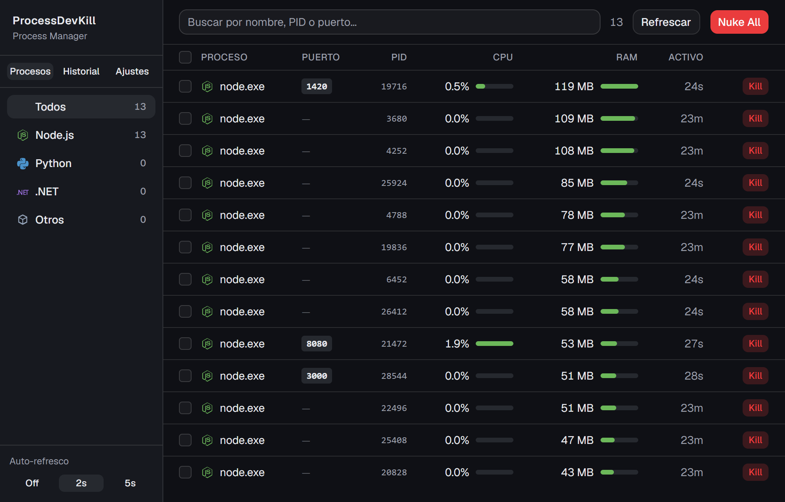
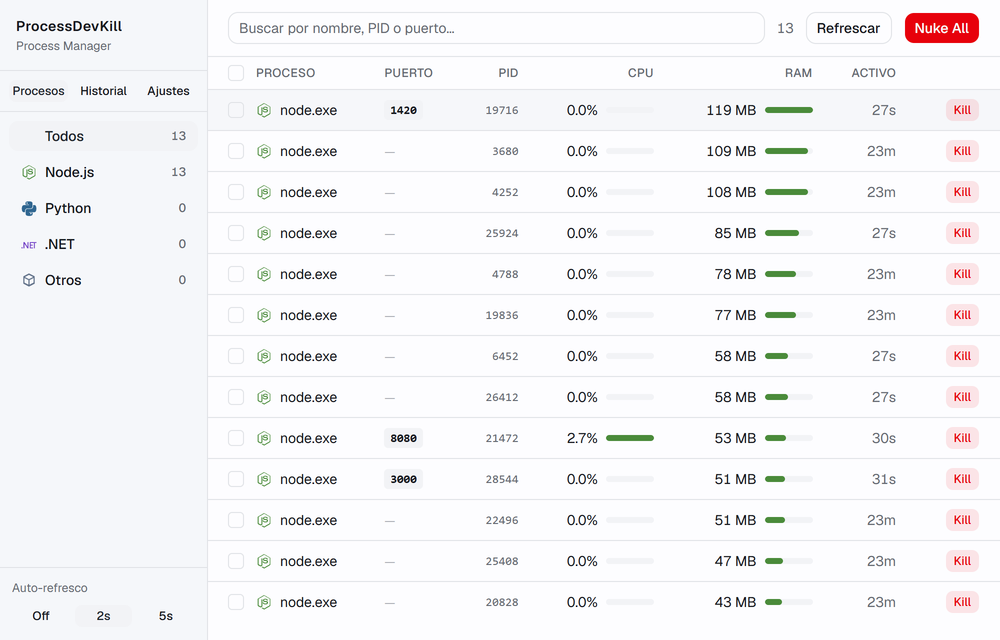
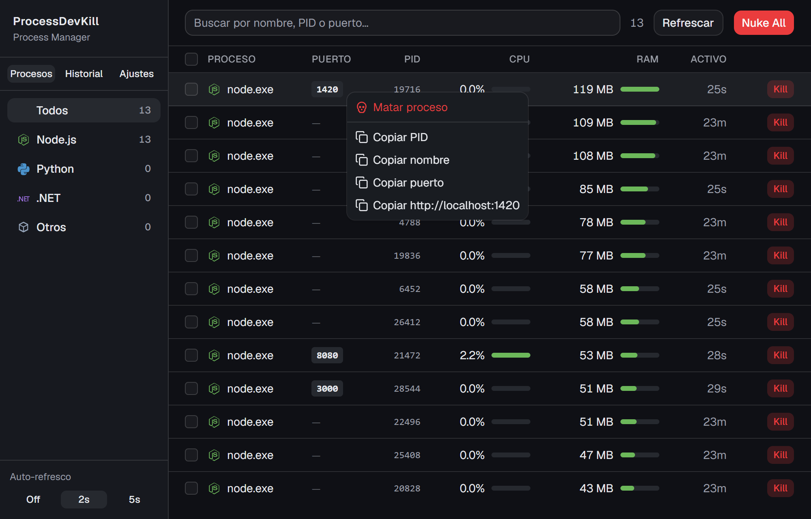
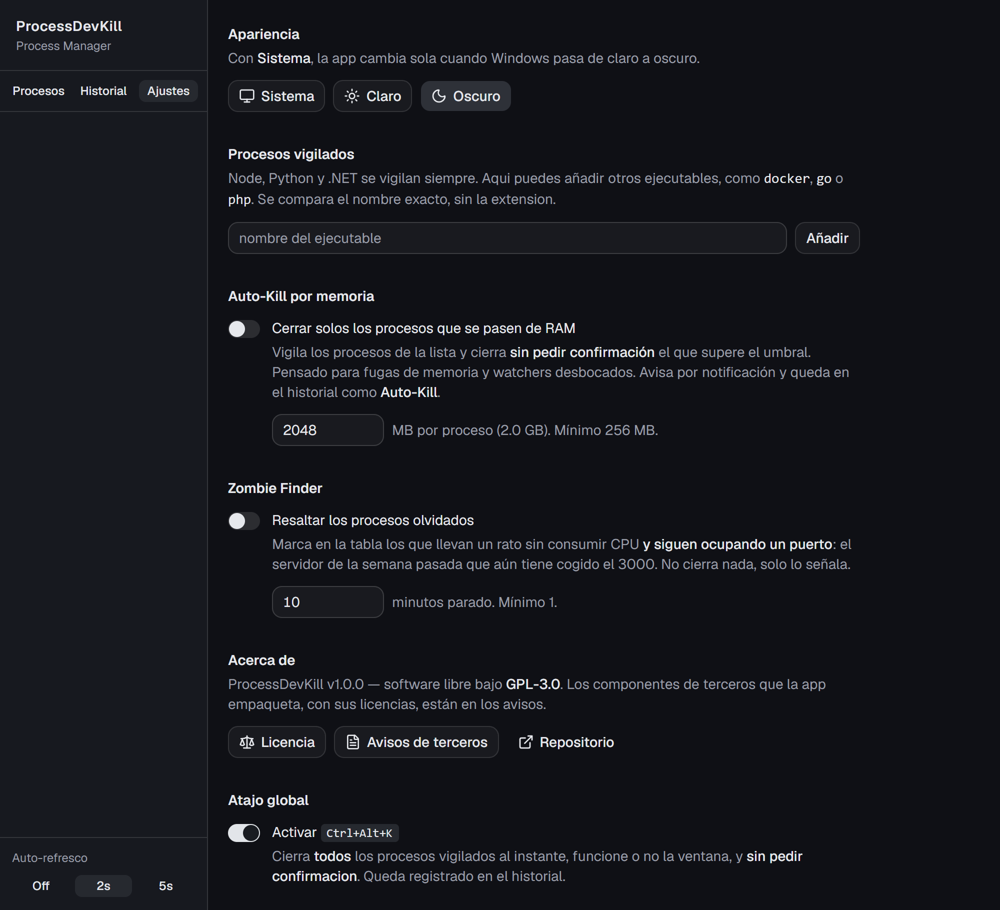
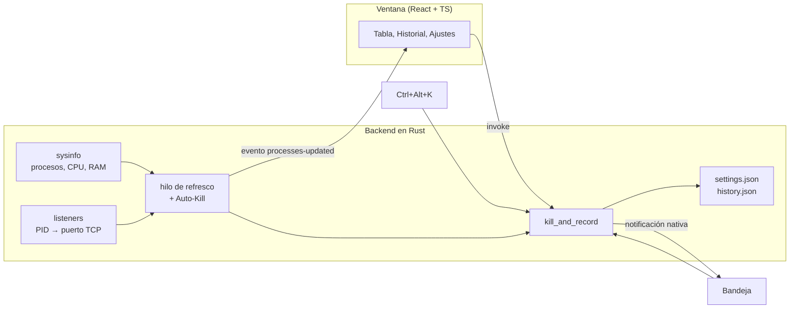

<div align="center">

# ProcessDevKill

**"El puerto 3000 está ocupado y no sé por quién."**

Gestor de procesos de desarrollo para Windows: lista los `node`, `python` y `dotnet` activos
con su CPU, su RAM y **el puerto local que ocupa cada uno**, y los cierra de uno en uno o en lote.

[](https://github.com/xfiberex/ProcessDevKill/releases/latest)
[](LICENSE)
[](#descarga-e-instalación)
[](https://tauri.app)



</div>

## El problema

Un `npm run dev` que sobrevivió al cierre de la terminal, y al día siguiente:

```
Error: listen EADDRINUSE: address already in use :::3000
```

La ruta larga es `netstat -ano | findstr :3000`, apuntar el PID, `taskkill /PID 12345 /F` y cruzar
los dedos por no haberte equivocado de número. El Administrador de tareas tampoco ayuda: enseña
veinte `node.exe` idénticos y no dice cuál escucha en el 3000.

ProcessDevKill enseña esa tabla ya hecha, con el puerto en su columna, y pone un botón al lado.

## Qué hace

- Lista **Node, Python y .NET** —más los ejecutables que añadas— con CPU, RAM, tiempo activo y los
  puertos TCP en escucha de cada proceso.
- Busca por nombre, PID **o número de puerto**: escribe `3000` y te queda la fila que lo ocupa.
- Cierra procesos de uno en uno, por selección múltiple o de golpe con **Nuke All**, siempre con
  confirmación.
- **Menú contextual** en cada fila: matar, o copiar el PID, el nombre, el puerto o
  `http://localhost:PUERTO`.
- **Icono en la bandeja** con acciones rápidas y atajo global <kbd>Ctrl</kbd>+<kbd>Alt</kbd>+<kbd>K</kbd>
  (desactivable) que cierra todo lo vigilado sin abrir la ventana.
- **Auto-Kill** (opcional, apagado de fábrica): cierra solo los procesos que pasen de un umbral de
  RAM, avisa por notificación y lo registra. Para fugas de memoria y watchers desbocados.
- **Zombie Finder** (opcional, apagado de fábrica): resalta los procesos que llevan minutos sin
  consumir CPU **y siguen ocupando un puerto** — el servidor de la semana pasada. No cierra nada,
  solo lo señala.
- **Historial** de cierres con el origen de cada uno: ventana, bandeja, atajo o Auto-Kill.
- Tema claro/oscuro que sigue al de Windows, o fijo si lo prefieres.

## Capturas

<table>
  <tr>
    <td width="50%"></td>
    <td width="50%"></td>
  </tr>
  <tr>
    <td align="center"><em>Tema claro, siguiendo al de Windows</em></td>
    <td align="center"><em>Clic derecho: matar o copiar PID, nombre, puerto o la URL</em></td>
  </tr>
</table>

<div align="center">
  
  <p><em>Ajustes: procesos vigilados, Auto-Kill, Zombie Finder y el atajo global</em></p>
</div>

> Las capturas se regeneran con [`tools/capture-screenshots.ps1`](tools/capture-screenshots.ps1),
> que conduce la app de verdad; no están retocadas.

## Descarga e instalación

Desde la **[página de releases](https://github.com/xfiberex/ProcessDevKill/releases/latest)**:

| Archivo | Para qué | Tamaño |
|---|---|---|
| `ProcessDevKill_X.Y.Z_x64-setup.exe` | **Recomendado** (NSIS). Instala en `%LOCALAPPDATA%\ProcessDevKill` para el usuario actual, sin pedir permisos de administrador. | ~2,4 MB |
| `ProcessDevKill_X.Y.Z_x64_en-US.msi` | MSI, para despliegue por directiva de grupo o quien lo prefiera. | ~3,5 MB |
| `*.sha256` | El hash de cada instalador, por si quieres verificar la descarga. | — |

Requiere **Windows 10 o 11 (x64)** con **WebView2**, que viene de serie en Windows 11 y en Windows
10 actualizado. No hay versión de macOS ni de Linux: la app usa `sysinfo` y `listeners`, que sí son
multiplataforma, pero no está probada fuera de Windows y el `.dmg` no se puede generar desde aquí.

Para desinstalar: *Configuración → Aplicaciones → ProcessDevKill*, o el `uninstall.exe` que queda
en la carpeta de instalación.

### El aviso de SmartScreen

Los instaladores **no están firmados**, así que la primera vez Windows enseñará *"Windows protegió
su PC"*: **Más información → Ejecutar de todas formas**. No es un fallo del instalador ni una
detección de nada; es lo que le pasa a cualquier ejecutable sin certificado de firma de código,
que cuesta dinero y todavía no lo tiene este proyecto.

### Verificar la descarga (opcional)

```powershell
Get-FileHash .\ProcessDevKill_1.0.0_x64-setup.exe -Algorithm SHA256
```

El resultado tiene que coincidir con el contenido del `.sha256` que acompaña al archivo (formato de
`sha256sum`: el hash y el nombre del archivo).

> **Qué protege y qué no.** El hash viaja por el mismo sitio que el instalador, así que sirve para
> detectar una descarga corrupta o a medias, no para demostrar quién publicó el archivo. Para eso
> haría falta una firma, y la app tampoco tiene auto-actualización que verifique nada por su cuenta.
> Está en el [roadmap](ROADMAP.md#5-auto-actualización).

## Privacidad

Esta app lee la lista de procesos de tu equipo, así que conviene decir en voz alta qué hace con ella:

- **No sale nada de tu máquina.** No hay telemetría, ni analítica, ni comprobación de versiones. La
  app no tiene concedido ningún permiso de red en sus [capabilities](src-tauri/capabilities/default.json).
- Lee **nombre, PID, CPU, RAM, tiempo activo y puertos TCP en escucha** de los procesos vigilados.
  No lee la línea de comandos, ni variables de entorno, ni el contenido de nada.
- Los ajustes y el historial se guardan **en tu equipo**, en `%APPDATA%\com.processdevkill.app\`
  (`settings.json` e `history.json`). Se pueden abrir, copiar entre equipos o borrar; el historial
  se puede vaciar desde la propia app y tiene un tope de 200 entradas.
- Lo único que sale al exterior es el navegador que abres tú al pulsar **Repositorio** en Ajustes.

## Cómo funciona



Cuatro decisiones explican casi todo el diseño; el resto están en
[CONTEXT.md §4](CONTEXT.md#4-decisiones-tomadas), con su fecha y su motivo:

- **El frontend no hace polling.** Un hilo de Rust enumera procesos y sockets y empuja el evento
  `processes-updated`; React solo escucha. El intervalo se configura desde la UI.
- **Todo cierre pasa por `kill_and_record`.** La ventana, la bandeja, el atajo global y el Auto-Kill
  comparten camino, así que los cuatro notifican, registran en el historial y refrescan igual. Tres
  rutas separadas se habrían desincronizado a la primera.
- **Los puertos se filtran por TCP + `Listen`.** `listeners::get_all()` devuelve también las
  conexiones salientes: sin ese filtro la columna enseñaría puertos efímeros al azar en vez del
  puerto donde sirve tu servidor.
- **La persistencia son archivos JSON propios**, no un store de frontend: la bandeja y el atajo
  escriben historial con la ventana cerrada, cuando no hay JavaScript vivo que pueda hacerlo.

## Stack

| Capa | Tecnología |
|---|---|
| Shell de escritorio | **Tauri 2** (Rust + WebView2) |
| Frontend | **React 19 + TypeScript + Vite** |
| Estilos | **Tailwind CSS v4** (plugin de Vite, sin archivo de configuración) |
| Componentes | **shadcn/ui** estilo `base-nova`, sobre **Base UI**; toasts con **Sonner** |
| Animaciones | **Motion** (`motion/react`) |
| Procesos | crate **`sysinfo`** |
| Puertos por PID | crate **`listeners`** — `sysinfo` no los expone |
| Plugins Tauri | `notification`, `global-shortcut`, `clipboard-manager`, `opener` + `tray-icon` |

## Desarrollo

Prerequisitos: **Node.js LTS**, **Rust estable** ([rustup](https://rustup.rs)) y, en Windows, el
componente **MSVC C++ build tools x64/x86** con el **Windows SDK** desde el Visual Studio Installer
(`Microsoft.VisualStudio.Component.VC.Tools.x86.x64`). Sin los headers y las librerías de MSVC,
`cargo` falla al enlazar.

```bash
npm install
npm run tauri dev      # app de escritorio con hot reload
npm run build          # comprueba tipos y compila el frontend
npm run tauri build    # genera los instaladores NSIS y MSI
```

```bash
cd src-tauri && cargo test    # 22 pruebas del backend
```

Las pruebas de Rust leen los procesos reales del equipo y **solo matan procesos que lanzan ellas
mismas**; ninguna toca los tuyos.

| Herramienta | Para qué |
|---|---|
| [`tools/capture-screenshots.ps1`](tools/capture-screenshots.ps1) | Regenera las capturas del README conduciendo la app por CDP. |
| [`release.ps1`](release.ps1) | Corta una versión entera: pruebas, bump en los tres sitios, build, tag y GitHub Release. Admite `-DryRun`. |
| `npm run tauri icon app-icon.svg` | Regenera todos los tamaños de icono tras editar `app-icon.svg`. |

## Estructura

| Ruta | Contenido |
|---|---|
| `src/` | Frontend React: vistas, tipos compartidos con Rust y tema |
| `src/components/ui/` | Componentes de shadcn/ui (generados; se editan a mano si hace falta) |
| `src-tauri/src/lib.rs` | Comandos de Tauri y arranque |
| `src-tauri/src/{processes,ports,storage,tray}.rs` | Procesos, puertos, persistencia y bandeja |
| `src-tauri/capabilities/` | Permisos concedidos a la ventana |
| `tools/`, `docs/screenshots/` | Utilidades del repositorio y capturas del README |
| `app-icon.svg` | Icono fuente del que salen todos los tamaños |
| [ROADMAP.md](ROADMAP.md) | Plan de desarrollo por fases, con lo verificado en cada una |
| [CONTEXT.md](CONTEXT.md) | Estado actual, decisiones tomadas y registro de sesiones |

## Estado

La v1.0.0 está publicada y verificada sobre la app instalada. Lo que todavía **no** hay, por si
importa antes de instalarla: firma de código (de ahí el aviso de SmartScreen), auto-actualización,
pruebas automáticas del frontend y compilaciones para macOS o Linux. El plan está en el
[ROADMAP](ROADMAP.md).

## Licencia

Software libre bajo la **[GNU General Public License v3.0](LICENSE)** (GPLv3): puedes usarlo,
estudiarlo, modificarlo y redistribuirlo, **siempre que los derivados conserven la misma licencia y
publiquen su código fuente**. Se ofrece **sin ninguna garantía**.

Las licencias de los componentes de terceros que el instalador empaqueta —incluida la tipografía
Geist, con su licencia OFL-1.1— están en [THIRD-PARTY-NOTICES.txt](THIRD-PARTY-NOTICES.txt). Todas
son permisivas y compatibles con la GPLv3.
