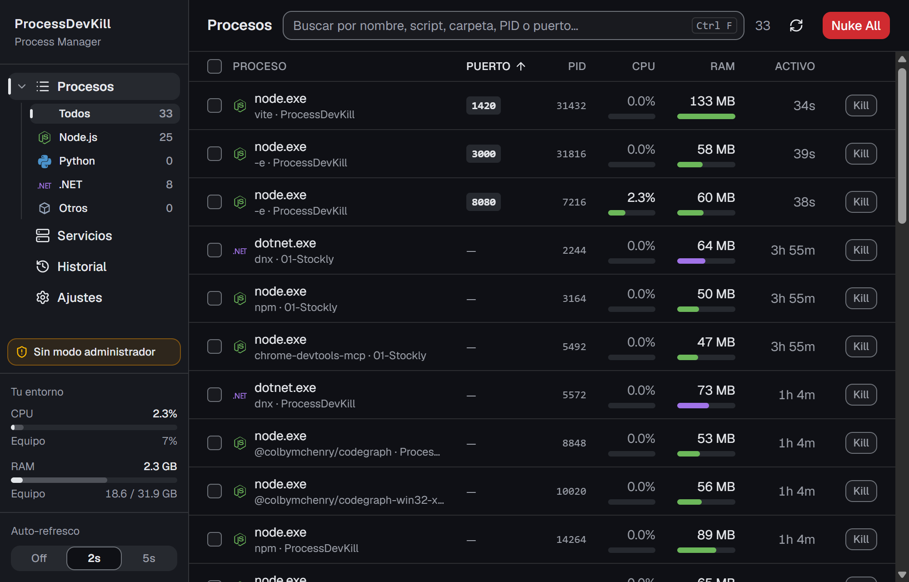
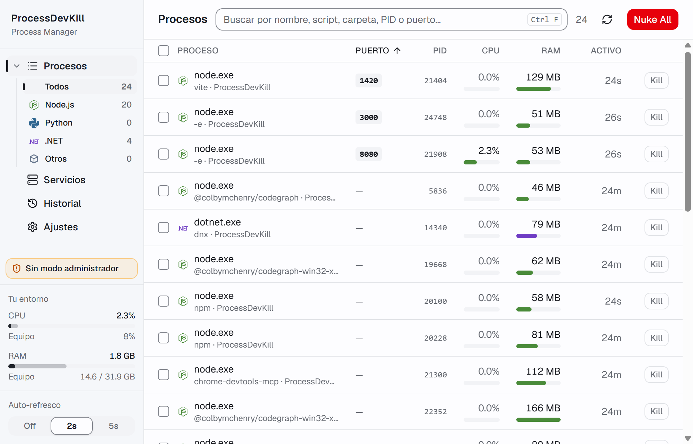
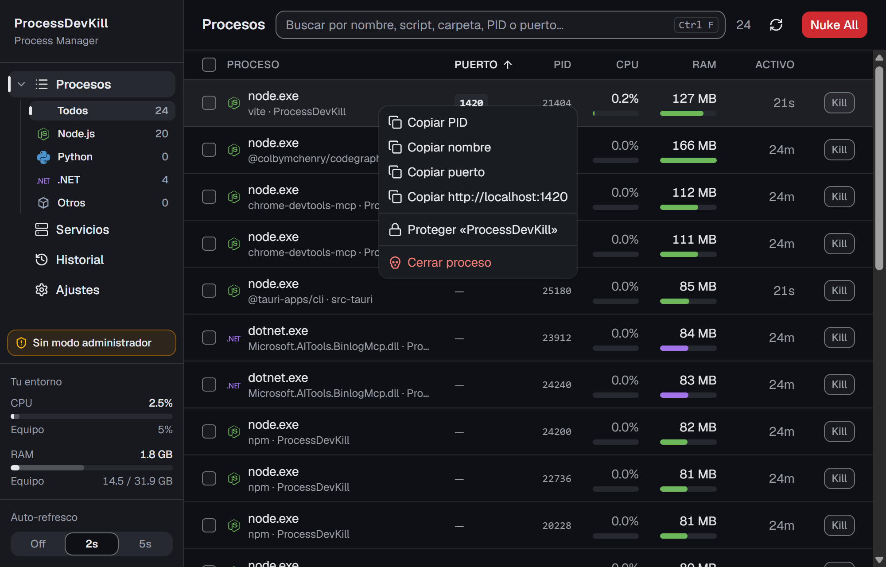
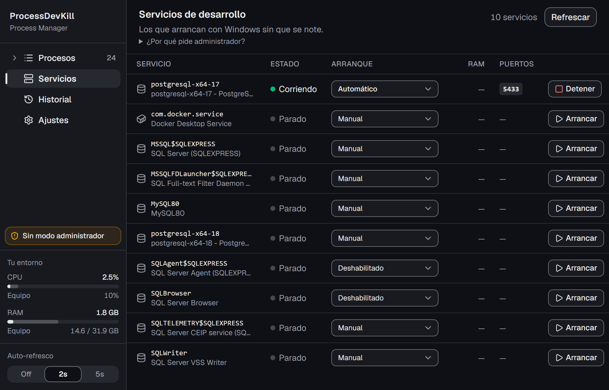
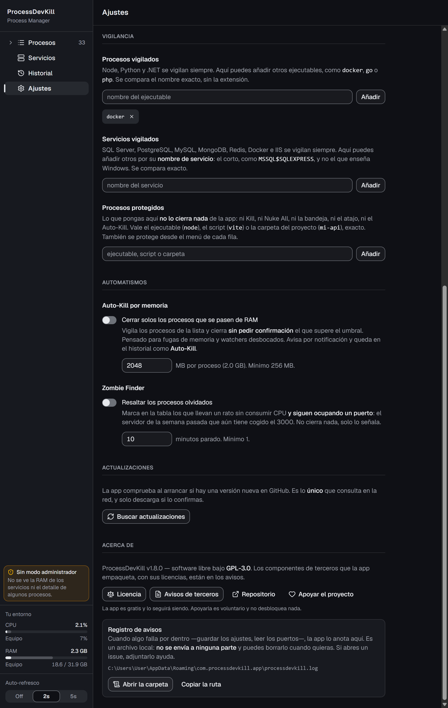
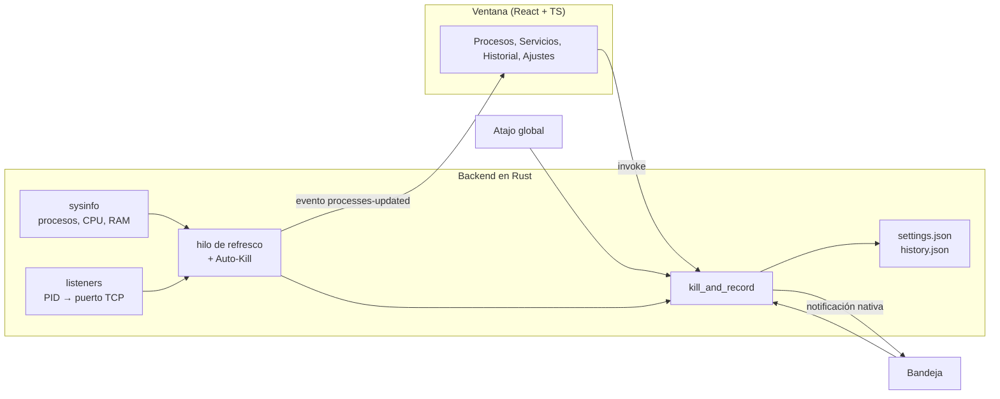

<div align="center">

# ProcessDevKill

**"El puerto 3000 está ocupado y no sé por quién."**

Gestor de procesos de desarrollo para Windows: lista los `node`, `python`, `dotnet`, `java`,
`deno` y `bun` activos con su CPU, su RAM y **el puerto local que ocupa cada uno**, y los cierra de uno en uno o en lote.

[](https://github.com/xfiberex/ProcessDevKill/releases/latest)
[](https://github.com/xfiberex/ProcessDevKill/actions/workflows/ci.yml)
[](LICENSE)
[](#descarga-e-instalación)
[](https://tauri.app)



</div>

## El problema

Un `npm run dev` que sobrevivió al cierre de la terminal, y al día siguiente:

```
Error: listen EADDRINUSE: address already in use :::3000
```

La ruta larga es `netstat -ano | findstr :3000`, apuntar el PID, `taskkill /PID 12345 /F` y cruzar
los dedos por no haberte equivocado de número. El Administrador de tareas tampoco ayuda: enseña
veinte `node.exe` idénticos y no dice cuál escucha en el 3000.

ProcessDevKill enseña esa tabla ya hecha, con el puerto en su columna, y pone un botón al lado.

## Qué hace

**Ver qué corre**

- Lista **Node, Python, .NET, Java, Deno y Bun** —más los ejecutables que añadas— con CPU, RAM,
  tiempo activo y los puertos TCP en escucha de cada proceso. *(Java, Deno y Bun, desde la
  v1.10.0.)*
- **Cada fila dice qué es**: debajo de `node.exe`, el script y la carpeta del proyecto
  —`vite · mi-web`—, para saber cuál de los trece `node.exe` es el tuyo.
- Busca por nombre, script, carpeta, PID **o número de puerto**: escribe `3000` y te queda la fila
  que lo ocupa. <kbd>Ctrl</kbd>+<kbd>F</kbd> lleva al buscador desde cualquier vista.
- **Medidor del entorno** en el sidebar: cuánta CPU y RAM del equipo se lleva lo que estás
  desarrollando, sobre el total de la máquina.

**Cerrar sin equivocarte**

- **Kill** en cada fila, o por selección múltiple o de golpe con **Nuke All**, que piden
  confirmación. Mientras el puntero está sobre la tabla **las filas no cambian de sitio**, para que
  el Kill que tienes debajo siga siendo el del mismo proceso.
- **Procesos protegidos** —por ejecutable, script o carpeta—: no los cierra nada de la app. Y los
  procesos críticos de Windows (`svchost`, `csrss`, `explorer`…) no se pueden vigilar aunque se
  añadan *(desde la v1.8.1)*.
- **Si usas un programa en Java que no es de desarrollo** —un juego, una aplicación de escritorio—,
  protégelo: Java se vigila siempre, y Nuke All, la bandeja, el atajo y el Auto-Kill cierran sin
  mirar qué es cada fila *(desde la v1.10.0)*.
- **Menú contextual** en cada fila, con clic derecho o con teclado: copiar el PID, el nombre, el
  puerto o `http://localhost:PUERTO`, proteger el proceso y, al final, cerrarlo.
- **Historial** de cierres con su origen —ventana, bandeja, atajo o Auto-Kill—, agrupado por acción.

**Sin abrir la ventana**

- **Icono en la bandeja** con acciones rápidas.
- **Atajo global** (apagado de fábrica) que cierra todo lo vigilado. La combinación se elige, y pide
  **dos pulsaciones**: la primera solo avisa de cuántos caerían.
- **Auto-Kill** (apagado de fábrica): cierra los procesos que pasen de un umbral de RAM, lo avisa y
  lo registra. Para fugas de memoria y watchers desbocados.
- **Zombie Finder** (apagado de fábrica): resalta los procesos que llevan minutos sin consumir CPU
  **y siguen ocupando un puerto** —el servidor de la semana pasada—. No cierra nada.

**Servicios de desarrollo**

- SQL Server, PostgreSQL, MySQL, MongoDB, Redis, Docker e IIS, con su estado, su tipo de arranque y
  su puerto. Es donde se ve que tienes dos PostgreSQL arrancando con Windows sin saberlo.
- Se pueden **arrancar, detener y cambiarles el tipo de arranque**. Windows pide permisos de
  administrador **solo en ese momento**, y la app **anota lo que cambió** para poder deshacerlo.
- **Dice lo que no puede ver sin ser administrador** —la RAM de los servicios, y el script de los
  procesos abiertos desde una terminal elevada—, y desde Ajustes se puede reiniciar elevada o
  **arrancar siempre así** (apagado de fábrica).

**Y además**

- Tema claro u oscuro, siguiendo al de Windows o fijo.
- **Español e inglés**, también en el menú de la bandeja y las notificaciones, y desde la
  v1.8.1 en los mensajes de error. Se cambia en Ajustes, sin reiniciar.
- **Avisa de versiones nuevas** y las instala desde Ajustes, comprobando el hash del instalador antes de
  ejecutarlo.

## Capturas

<table>
  <tr>
    <td width="50%"></td>
    <td width="50%"></td>
  </tr>
  <tr>
    <td align="center"><em>Tema claro, siguiendo al de Windows</em></td>
    <td align="center"><em>Clic derecho: copiar, proteger o cerrar</em></td>
  </tr>
  <tr>
    <td width="50%"></td>
    <td width="50%"></td>
  </tr>
  <tr>
    <td align="center"><em>Servicios: arrancar, detener y cambiar el arranque</em></td>
    <td align="center"><em>Ajustes: vigilados, protegidos, Auto-Kill y Zombie Finder</em></td>
  </tr>
</table>

> Las capturas las genera [`tools/capture-screenshots.ps1`](tools/capture-screenshots.ps1)
> conduciendo la app de verdad, con los procesos y servicios reales del equipo; no están retocadas.

## Descarga e instalación

Desde la **[página de releases](https://github.com/xfiberex/ProcessDevKill/releases/latest)**:

| Archivo | Para qué | Tamaño |
|---|---|---|
| `ProcessDevKill_X.Y.Z_x64-setup.exe` | **Recomendado** (NSIS). Instala en `%LOCALAPPDATA%\ProcessDevKill` para el usuario actual, sin pedir permisos de administrador. | ~3,9 MB |
| `ProcessDevKill_X.Y.Z_x64_en-US.msi` | MSI, para despliegue por directiva de grupo o quien lo prefiera. | ~6,2 MB |
| `*.sha256` | El hash de cada instalador, por si quieres verificar la descarga. | — |

Requiere **Windows 10 o 11 (x64)** con **WebView2**, que viene de serie en Windows 11 y en Windows
10 actualizado. No hay versión de macOS ni de Linux: no está probada fuera de Windows, y el panel de
servicios habla con el gestor de servicios de Windows.

Para desinstalar: *Configuración → Aplicaciones → ProcessDevKill*.

**El aviso de SmartScreen.** Los instaladores **no están firmados**, así que la primera vez Windows
enseñará *«Windows protegió su PC»*: **Más información → Ejecutar de todas formas**. No es un fallo
ni una detección: es lo que le pasa a cualquier ejecutable sin certificado de firma de código, que
es de pago y que **el proyecto ha decidido no comprar**.

**Verificar la descarga (opcional).** El resultado tiene que coincidir con el `.sha256` que acompaña
al archivo, que está en formato `sha256sum`:

```powershell
Get-FileHash .\ProcessDevKill_X.Y.Z_x64-setup.exe -Algorithm SHA256
```

## Actualizaciones

La app comprueba al arrancar si hay una versión nueva y avisa con un toast; desde la v1.9.0, esa
comprobación se puede apagar en *Ajustes → Actualizaciones*. La descarga y la
instalación **no ocurren solas**: se lanzan desde *Ajustes → Actualizaciones*, con el número de
versión y las notas delante. Al confirmar, **la instalación es silenciosa**: la app se cierra, se
actualiza y vuelve a abrirse sola, sin ningún asistente.

### El modelo de confianza, y qué no cubre

El instalador descargado se compara con el **`.sha256` publicado como asset del mismo release**. Si
no coincide, se borra y no se instala. Desde la v1.8.1 se vuelve a comprobar **justo antes
de ejecutarlo**, y hasta entonces queda bloqueado para que ningún otro programa pueda cambiarlo. La
implementación está en [`src-tauri/src/update.rs`](src-tauri/src/update.rs).

Dicho claramente, esto **detecta una descarga corrupta o manipulada en tránsito** —y, desde la
v1.8.1, también mientras espera en el disco—, y nada más:

- **No demuestra quién publicó el archivo.** El instalador y su hash salen del mismo release, así
  que quien pudiera sustituir el `.exe` podría sustituir también el `.sha256`. No protege frente a
  un compromiso de la cuenta de GitHub.
- **No sustituye a la firma de código**, y no es un paso intermedio hacia ella: la firma se descartó
  el 2026-08-18. El `.sha256` **es** el mecanismo de integridad del proyecto.
- **Si un release no publicara su `.sha256`, la app se negaría a actualizarse a él.** Sin nada con
  que verificar, no se ejecuta un binario descargado.

## Privacidad

Esta app lee la lista de procesos de tu equipo, así que conviene decir en voz alta qué hace con ella.

**Nada de lo que lee sale de tu máquina.** No hay telemetría ni analítica.

- De los procesos vigilados lee **nombre, PID, CPU, RAM, tiempo activo y puertos TCP en escucha**.
- De esos mismos procesos —**solo de los vigilados**, no de los ~300 del equipo— lee también **la
  línea de comandos y la carpeta de trabajo**, una vez por proceso, y se queda **solo con dos
  nombres cortos**: el script (`vite`, `server.js`, `-m uvicorn`) y el último tramo de la carpeta
  (`mi-api`). **Nunca enseña la línea entera** ni el código en línea (`node -e …`). El script es el
  primer argumento que no empieza por `-` —saltando, desde la v1.8.3, el valor de las
  opciones que la app conoce, como `-r` o `-X`—, así que una opción **que no conozca** con su valor
  separado por un espacio (`node --token abc123 server.js`) enseña ese valor en su lugar: si pasas secretos por la línea de
  comandos, mejor con `=` (`--token=abc123`), que no se muestra. Esos nombres viven en memoria y no
  se guardan en el historial.
- No lee variables de entorno, ni la memoria de los procesos más allá de eso, ni ningún archivo.
- Para el panel de servicios pregunta al **Gestor de control de servicios de Windows** por los
  servicios instalados, su estado, su arranque y sus dependencias. Es lectura, no pide privilegios y
  se hace **solo al abrir esa vista o al refrescarla**.

**Permisos de administrador.** De fábrica, la app no los tiene. Arrancar o detener un servicio, o
cambiarle el arranque, sí los necesita: la app relanza **su propio ejecutable** con el aviso de UAC,
ese proceso hace **una** llamada al sistema y termina, sin ventana y sin red. Si cierras el aviso, no
se hace nada. Correr elevada entera es opcional, desde Ajustes, y Windows lo confirma cada vez.

**Lo que guarda**, todo en `%APPDATA%\com.processdevkill.app\` y todo en tu equipo:

- `settings.json`, `history.json` (tope de 200 entradas, y se vacía desde la app) y
  `service-changes.json`, que guarda **solo** los tipos de arranque que cambió la app, para poder
  deshacerlos.
- `processdevkill.log`, un **registro de avisos** cuando algo falla por dentro —no se pudo guardar
  el historial, no se pudieron leer los puertos—. Anota el fallo, no lo que corre en tu equipo; está
  para adjuntarlo si abres un issue. Ocupa **como mucho 1 MB**: rota cada 512 KB y guarda una
  generación anterior. La ruta está en **Ajustes → Acerca de**.

**La red.** La única petición que hace la app por su cuenta es la comprobación de actualizaciones al
arrancar, a la API de `github.com`, sin identificador ni cuenta: GitHub verá tu IP como si abrieras
la página. No se descarga nada sin que lo confirmes. Lo demás lo abres tú, como el navegador al
pulsar **Repositorio**. Desde la v1.9.0, esa comprobación tiene un interruptor en
*Ajustes → Actualizaciones*: apagado, la app no hace **ninguna** petición por su cuenta.

Los permisos de la ventana son los mínimos para lo anterior, y se pueden comprobar en
[`capabilities/default.json`](src-tauri/capabilities/default.json): el portapapeles es de **solo
escritura**, abrir archivos está acotado a los dos avisos legales, y la ventana no tiene ningún
permiso para salir a internet; desde la v1.8.1, tampoco para mandar notificaciones. Las
dos cosas las hace Rust.

## Cómo funciona


```mermaid
flowchart LR
    subgraph Rust["Backend en Rust"]
        S["sysinfo<br/>procesos, CPU, RAM"]
        L["listeners<br/>PID → puerto TCP"]
        H["hilo de refresco<br/>+ Auto-Kill"]
        K["kill_and_record"]
        J["settings.json<br/>history.json"]
    end
    subgraph Web["Ventana (React + TS)"]
        U["Procesos, Servicios, Historial, Ajustes"]
    end
    B["Bandeja"]
    A["Atajo global"]

    S --> H
    L --> H
    H -- "evento processes-updated" --> U
    U -- "invoke" --> K
    B --> K
    A --> K
    H --> K
    K --> J
    K -- "notificación nativa" --> B
```

Cuatro decisiones explican casi todo el diseño; el resto están en
[CONTEXT.md §4](CONTEXT.md#4-decisiones-tomadas), con su fecha y su motivo:

- **El frontend no hace polling.** Un hilo de Rust enumera procesos y sockets y empuja el evento
  `processes-updated`; React solo escucha.
- **Todo cierre pasa por `kill_and_record`.** La ventana, la bandeja, el atajo y el Auto-Kill
  comparten camino: los cuatro notifican, registran y refrescan igual, y rechazan igual a los
  protegidos.
- **Los puertos se filtran por TCP + `Listen`.** Sin ese filtro, la columna enseñaría los puertos
  efímeros de las conexiones salientes en vez del puerto donde sirve tu servidor.
- **La persistencia son archivos JSON propios**, no un store de frontend: la bandeja y el atajo
  escriben historial con la ventana cerrada, cuando no hay JavaScript vivo.

## Stack

| Capa | Tecnología |
|---|---|
| Shell de escritorio | **Tauri 2** (Rust + WebView2) |
| Frontend | **React 19 + TypeScript + Vite** |
| Estilos | **Tailwind CSS v4** (plugin de Vite, sin archivo de configuración) |
| Componentes | **shadcn/ui** estilo `base-nova`, sobre **Base UI**; toasts con **Sonner** |
| Animaciones | **Motion** (`motion/react`) |
| Procesos | crate **`sysinfo`** |
| Puertos por PID | crate **`listeners`** — `sysinfo` no los expone |
| Pruebas | **Vitest + Testing Library** (frontend) y `cargo test` (backend) |
| CI | **GitHub Actions** en `windows-latest`: solo comprueba, no publica |
| Plugins Tauri | `notification`, `global-shortcut`, `clipboard-manager`, `opener` + `tray-icon` |
| Actualizaciones | crate **`reqwest`** (rustls) + **`sha2`** — implementación propia, sin plugin |

## Desarrollo

Prerequisitos: **Node.js LTS**, **Rust estable** ([rustup](https://rustup.rs)) y los **MSVC C++
build tools x64/x86** con el **Windows SDK**, desde el Visual Studio Installer
(`Microsoft.VisualStudio.Component.VC.Tools.x86.x64`). Sin ellos, `cargo` falla al enlazar.

```bash
npm install
npm run tauri dev             # app de escritorio con hot reload
npm run build                 # comprueba tipos y compila el frontend
npm test                      # pruebas del frontend (Vitest + Testing Library)
cd src-tauri && cargo test    # pruebas del backend
```

Las pruebas de Rust leen los procesos reales del equipo y **solo cierran procesos que lanzan ellas
mismas**; ninguna toca los tuyos. Las del frontend corren en jsdom con los módulos de Tauri
doblados. [`src/types.test.ts`](src/types.test.ts) lee además el fuente de Rust y compara las
constantes espejo, para que el contrato entre los dos lados no se desincronice en silencio.

**Integración continua.** Cada push a `main` y cada pull request pasan por
[`.github/workflows/ci.yml`](.github/workflows/ci.yml): ESLint, las dos suites, `npm run build` y
clippy en `windows-latest`, porque la app solo es de Windows; y `npm audit` y `cargo audit` en
Ubuntu, también **cada lunes**, porque un aviso de seguridad nuevo sale sin que nadie haga push. Son
las mismas comprobaciones que hace `release.ps1` antes de cortar una versión. La CI **solo
comprueba**: corre sin secretos y no publica nada.

| Herramienta | Para qué |
|---|---|
| [`release.ps1`](release.ps1) | Corta una versión entera: pruebas, versión en los tres sitios, build, `.sha256`, tag y GitHub Release. Admite `-DryRun`. |
| [`tools/capture-screenshots.ps1`](tools/capture-screenshots.ps1) | Regenera las capturas de este README conduciendo por CDP una copia aparte de la app, sin tocar la instalada ni sus ajustes. |
| [`tools/avisos-de-terceros.mjs`](tools/avisos-de-terceros.mjs) | Genera `THIRD-PARTY-NOTICES.txt` a partir de las dependencias que viajan en el instalador. Con `--comprobar`, dice si se quedó viejo. |
| [`tools/auditoria-ui.mjs`](tools/auditoria-ui.mjs) | Recorre la app en marcha y deja capturas y medidas —tamaños, zoom, foco, contraste, axe— en una carpeta fuera del repositorio. No comprueba nada: mide. |
| [`tools/prueba-en-marcha.mjs`](tools/prueba-en-marcha.mjs) | Arranca el binario de release y comprueba que lista, cierra, protege y descarga como dice. Lo lanza `release.ps1`. |
| `npm run tauri icon app-icon.svg` | Regenera todos los tamaños de icono tras editar `app-icon.svg`. |

## Estructura

| Ruta | Contenido |
|---|---|
| `src/` | Frontend React: vistas, tipos compartidos con Rust, textos en los dos idiomas y tema |
| `src/components/`, `src/hooks/`, `src/lib/` | Componentes de la app, hooks de React y utilidades |
| `src/components/ui/` | Componentes de shadcn/ui (generados; se editan a mano si hace falta) |
| `src-tauri/src/lib.rs` | Arranque de la app y estado compartido |
| `src-tauri/src/commands.rs` | Los comandos que llama la ventana (los que tienen lógica propia viven con ella) |
| `src-tauri/src/{processes,ports,storage}.rs` | Procesos, puertos y persistencia |
| `src-tauri/src/{poller,auto_kill,tray,hotkey,notify}.rs` | Hilo de refresco, Auto-Kill, bandeja, atajo global y avisos nativos |
| `src-tauri/src/services.rs` | Servicios de desarrollo, **solo lectura**: no puede arrancar ni detener nada |
| `src-tauri/src/service_control.rs` | Eleva una acción —arrancar, detener, cambiar el arranque— con su guardia |
| `src-tauri/src/elevation.rs` | Si la app corre como administrador, y relanzarla elevada cuando se pide |
| `src-tauri/src/textos.rs` | Todo el texto que escribe Rust —bandeja, notificaciones y errores—, en los dos idiomas |
| `src-tauri/src/update.rs` | Actualizaciones: consulta a GitHub, descarga y verificación SHA-256 |
| `src-tauri/src/logging.rs` | Registro de avisos en archivo, con rotación (en release no hay consola) |
| `src-tauri/capabilities/` | Permisos concedidos a la ventana |
| `tools/`, `docs/screenshots/` | Utilidades del repositorio y capturas de este README |
| `.github/workflows/` | La CI: pruebas, lint, build y auditorías |
| `.claude/skills/`, `.agents/skills/` | Packs de skills de agente (material de terceros; ni se compila ni se distribuye) |

Y la documentación, donde cada cosa vive en un solo sitio:

| Documento | Responde a |
|---|---|
| [CHANGELOG.md](CHANGELOG.md) | ¿Qué cambió en cada versión? |
| [ROADMAP.md](ROADMAP.md) | ¿Qué falta por hacer? |
| [CONTEXT.md](CONTEXT.md) | ¿En qué estado está, y por qué se decidió así? |
| [.claude/CLAUDE.md](.claude/CLAUDE.md) | ¿Cómo se trabaja en este repositorio? |
| [docs/TIERS-1-11.md](docs/TIERS-1-11.md), [docs/TIER-12.md](docs/TIER-12.md), [docs/TIER-13.md](docs/TIER-13.md) y [docs/REVISION-2026-08-18.md](docs/REVISION-2026-08-18.md) | ¿Qué se hizo ya, y qué enseñó? |
| [docs/BITACORA.md](docs/BITACORA.md) | ¿Cómo se llegó hasta aquí, sesión a sesión? |

## Estado

La versión actual es la **v1.10.1**. La primera pública fue la **v1.1.1**: las anteriores se retiraron
porque su mecanismo de actualización ya no existía. Lo que viene está en el [ROADMAP](ROADMAP.md).

Lo que **no** hay, por si importa antes de instalarla: **firma de código** —de ahí el aviso de
SmartScreen, que **va a seguir saliendo**: la firma no está en el plan— y versiones para **macOS o
Linux**.

## Licencia

Software libre bajo la **[GNU General Public License v3.0](LICENSE)** (GPLv3): puedes usarlo,
estudiarlo, modificarlo y redistribuirlo, **siempre que los derivados conserven la misma licencia y
publiquen su código fuente**. Se ofrece **sin ninguna garantía**.

Las licencias de los componentes de terceros que el instalador empaqueta —incluida la tipografía
Geist, con su licencia OFL-1.1— están en [THIRD-PARTY-NOTICES.txt](THIRD-PARTY-NOTICES.txt), y todas
son compatibles con la GPLv3. Desde la v1.9.1, ese archivo lo genera
[`tools/avisos-de-terceros.mjs`](tools/avisos-de-terceros.mjs) y reproduce la licencia y el aviso
de copyright de cada componente; dice también lo que no cubre. **No ha pasado una revisión legal.**

El repositorio incluye además **18 packs de skills de agente** en `.claude/skills/` y
`.agents/skills/`, unos 270 de los 400 archivos versionados. **No forman parte de la app**: no se
compilan, no viajan en el instalador y no intervienen en las pruebas ni en el corte de versión. Su
procedencia y sus licencias están en la sección 5 de
[THIRD-PARTY-NOTICES.txt](THIRD-PARTY-NOTICES.txt), incluido lo que **no** se ha podido verificar:
ocho no declaran licencia.
